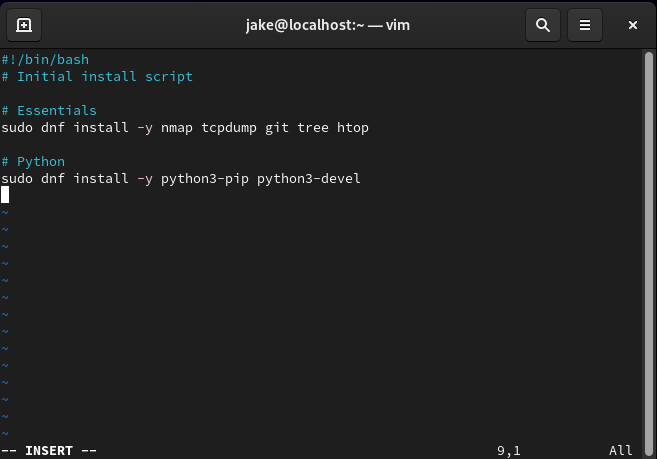

# RHEL 9 Server Project
I signed up for Red Hat's Developer program and was able to install RHEL.
I chose RHEL 9 because it is the current stable version.

## VM Setup
I am installing this as a virtual machine using QEMU/KVM and Virt-Manager.
My host system is running Arch.

**Software Selection**

Because I am new to RHEL, I am going with the "Server with GUI" install.
I am very comfortable using the command line, but I've found that with new systems it can be helpful to have
the "training wheels" on a little bit.

I am also downloading System and Development Tools right off the bat.

**Goals for this Project**
1. SELinux - I want to learn the ins and outs of SELinux.
    - How to configure it
    - How to troubleshoot it
    - And what exactly it does

2. Cockpit - All I know is that it;s a browser-based admin too. Seems interesting to learn.
3. Wireshark - Being that this will most likely become a server of some sort, I might as well get some wireshark and packet analysis practice in.
4. My last goal is to learn and get experience in the Red Hat ecosystem.

---

## Post Install
After install and update, I wrote a script to install the packages I knew I wanted.
Honestly, the only reason I did it as a script was to screenshot it and share it here.

However, I did run into an issue with htop. It wasn't found.
After some digging, I discovered that htop is part of a repo called "Extra Packages for Enterprise Linux".
It's maintained by the Fedora community (which is awesome!), but RHEL base repos only contain officially supported 
packages.

SO... I had to manually install the EPEL repository:
`sudo dnf install -y https://dl.fedoraproject.org/pub/epel/epel-release-latest-9.noarch.rpm`

Which then enabled me to install htop (and neofetch because it's fun).
Obviously, this wouldn't be so haphazardly done in an enterprise environment, but I wanted to figure out what was up.

